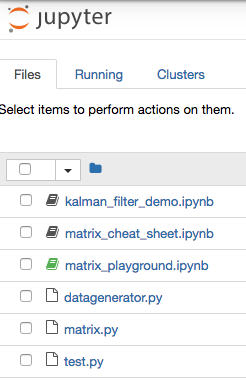
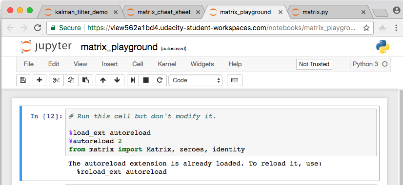

## Project Instructions

Your project workspace will contain several files. On the next page, you will see something like this:

    

We recommend that you open all of these files (except for two noted below) in new tabs so that your browser looks something like this:

    

You can ignore **datagenerator.py** and **test.py**, which you won't need to modify

**matrix.py** - This contains the beginnings of a Matrix class (which you will 
complete) as well as some helper functions zeroes and identity. This is the 
file you will be doing most of your work in.

**matrix_playground.ipynb** - A notebook that imports your Matrix class 
and calls the test code. You may find it useful to use this notebook as a 
place to use the matrix math code you will write in matrix.py.

**matrix_cheat_sheet.ipynb** - A Jupyter notebook with a glossary, explanation of matrix notation and list of matrix equations. Use this as a reference when filling out the methods in the Matrix class!

**kalman_filter_demo.ipynb** - You don't need to do anything with this notebook but you may find it interesting. Once your matrix class is working properly, the KF implemented here will actually work!

**Other Files** (feel free to ignore).

**test.py** - Contains test code which demonstrates the expected functionality of your code.

**datagenerator.py** - this just contains some helper code which is used by the Kalman Filter.

## Evaluation
Once you have completed your project, use the Project Rubric to review the project. If you have covered all of the points in the rubric, then you are ready to submit! If you see room for improvement in any category in which you do not meet specifications, keep working!

Your project will be evaluated by a Udacity reviewer according to the same Project Rubric. Your project must "meet specifications" in each category in order for your submission to pass.